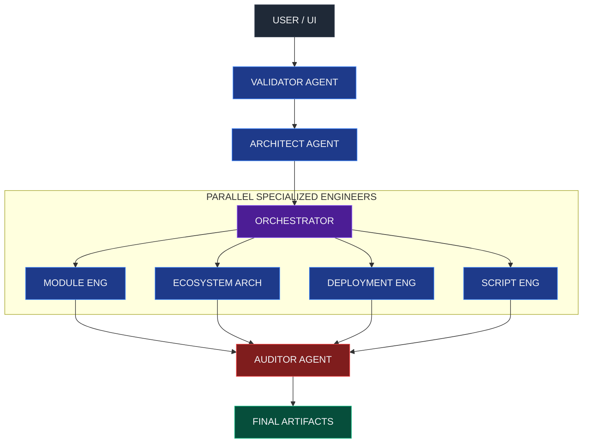

# CloudAccel Agent 🚀

**CloudAccel** is an AI-driven Infrastructure-as-Code (IaC) Accelerator designed to bridge the gap between High-Level Architecture definitions and production-ready Terraform code.

Built for the **Google Cloud AI Hackathon**, it leverages the reasoning capabilities of **Gemini 2.5 Flash** to act as a team of specialized DevOps engineers (Architect, Module Engineer, Security Auditor) working in parallel.

## 🌟 Why CloudAccel?

Modern DevOps is complex. writing Terraform from scratch is tedious, error-prone, and requires deep knowledge of provider-specific nuances.

CloudAccel solves this by:
1.  **Abstracting Complexity**: Users define "What" (Service + Details), AI handles "How" (HCL Syntax, Modules).
2.  **Enforcing Standards**: Automatically wraps best-practice Community Modules (`terraform-aws-modules`) instead of writing raw resources.
3.  **Day 2 Operations**: It doesn't just generate code; it generates **Import Scripts** for legacy infrastructure and supports **Reverse Sync** (Code-to-Design).
4.  **Security First**: An integrated Auditor Agent scans generated code against CIS/NIST standards before you ever run `terraform plan`.

## 🏗️ Architecture

CloudAccel uses a **Multi-Agent Orchestration Pattern**:

## 🛠️ Tech Stack

*   **Frontend**: React 19, TypeScript, Tailwind CSS
*   **AI Model**: Google Gemini 2.5 Flash (via `@google/genai` SDK)
*   **Tools**:
    *   **Google Search Grounding**: Used by Librarian & Validator agents to verify module versions and documentation.
    *   **D3.js**: For interactive Dependency & Architecture graphs.
    *   **JSZip**: For project export/import.

## 🚀 Key Features

### 1. Multi-Agent System
A coordinated workflow where specialized agents (Architect, Writer, Engineer) perform distinct tasks. The **Orchestrator** manages the state and dependency flow between them.

### 2. Google Search Grounding
The **Librarian Agent** uses live Google Search to find the latest verified versions of Terraform modules (e.g., `terraform-aws-modules/vpc/aws`), ensuring the code is never outdated.

### 3. Observability Console
A real-time **Agent Observability Console** (bottom panel) displays the internal thought process, status, and "Trace ID" of every AI action, providing transparency into the generation process.

### 4. History & Time Travel
Every action (Generation, Sync, Import) is snapshotted. Users can **Rollback** to any previous state using the Timeline feature, enabling safe experimentation.

### 5. Reverse Sync (Code-to-Design)
A unique "Designer Agent" that allows users to edit the generated Terraform code manually and then **Sync** those changes back to the high-level JSON configuration.

## 📦 Deployment

This application is designed as a **Client-Side SPA (Single Page Application)**. It requires no backend server.
*   **API Key**: Users bring their own Google Gemini API Key (stored securely in `localStorage`).
*   **Runtime**: Can be hosted on Vercel, Netlify, or Google Cloud Run (serving static assets).

## 📄 License

MIT License. Created for the Google Cloud AI Hackathon.