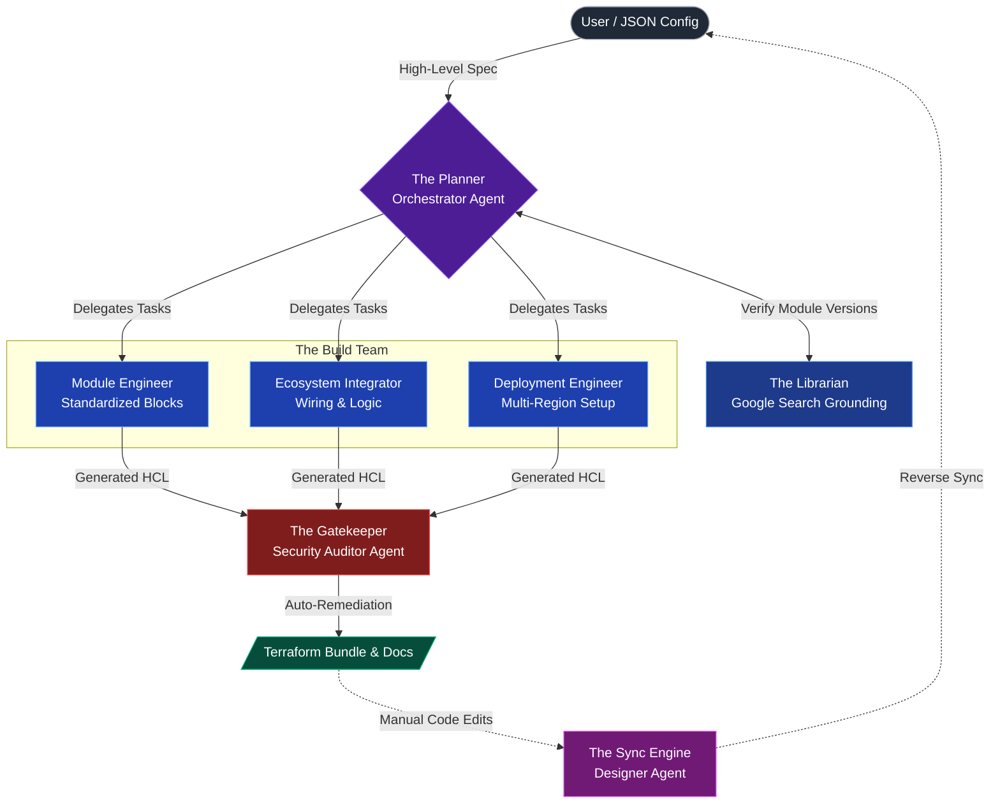

# CloudAccel: The Autonomous DevOps Implementation Engine

**CloudAccel** is an **Autonomous Enterprise Agent** that converts high-level architecture specifications into secure, standardized, and deployable Terraform ecosystems.

It bridges the "Last Mile" gap in DevOps by orchestrating a "Virtual Engineering Pod"—a team of specialized AI agents working in parallel to write, wire, secure, and document infrastructure.

---

## 💡 Inspiration (The Problem)

In the world of cloud infrastructure, there is a massive disconnect between **Architecture** and **Implementation**.

Solutions Architects design robust, compliant systems on whiteboards—for example, *"A PCI-DSS compliant payment gateway in US-East-1 with private networking."* However, translating that high-level intent into production-ready Infrastructure-as-Code (IaC) creates a significant bottleneck.

DevOps engineers are often left with "Blank Screen Paralysis," forced to manually write thousands of lines of Terraform boilerplate. This manual translation introduces critical risks:
*   **Inconsistency:** "Snowflake" infrastructure that varies from engineer to engineer.
*   **Security Drift:** Copy-pasting outdated snippets that leave ports open.
*   **Dependency Hell:** Wasting hours figuring out which module versions work together.

We realized that while LLMs are good at writing snippets, they struggle to build **cohesive, multi-file enterprise ecosystems**. We built CloudAccel to close this gap.

## 🚀 What it does (The Solution)

CloudAccel acts as a force multiplier for the DevOps team. It transforms the IaC workflow from a manual coding task into a **visual, intent-based design experience**.

1.  **Plan**: It analyzes your requirements and creates a file execution plan.
2.  **Research**: It uses **Google Search** to find the latest verified Terraform module versions.
3.  **Generate**: It spins up parallel agents to write the code (Modules, Ecosystem, Deployments).
4.  **Audit**: It scans the code for security risks (CIS/NIST) and **Auto-Remediates** them (e.g., closing port 22).
5.  **Reverse Sync**: If you manually edit the generated code, the **Designer Agent** updates the high-level architecture design to match, ensuring no drift.

---

## 🏗️ Architecture

CloudAccel utilizes a **Hub-and-Spoke Multi-Agent System** powered by **Google Gemini 2.5 Flash**.



---

## 🏆 Key Implementations (Hackathon Tracks)

We successfully implemented **4 key agentic concepts**:

### 1. Multi-Agent System (Parallel & Sequential)
We do not use a single "Chat with Code" loop. We use specialized personas:
*   **Sequential**: The `Orchestrator` passes tasks to the `Build Team`, whose output is passed to the `Auditor`.
*   **Parallel**: The `Module Engineer`, `Ecosystem Integrator`, and `Deployment Engineer` run concurrently to separate concerns (Component vs. Wiring vs. Environment).

### 2. Tools (Google Search Grounding)
The **Librarian Agent** solves the "Hallucinated Version" problem. It uses the `googleSearch` tool to query the live Terraform Registry, ensuring the generated code uses valid, up-to-date module versions (e.g., `terraform-aws-modules/vpc/aws v5.1.0`).

### 3. Observability (Logging & Tracing)
We built a dedicated **Agent Observability Console** (visible in the UI).
*   Every action has a unique **Trace ID**.
*   Users can see exactly what the agent is doing (e.g., "Scanning registry...", "Auto-remediating security group...").
*   Debug mode reveals the raw data stream.

### 4. Sessions & State (Reverse Sync)
CloudAccel is not a one-way generator. It maintains a **Project State**.
*   **Time Travel**: Users can rollback to any previous configuration snapshot via the History timeline.
*   **Bi-Directional Sync**: The `Designer Agent` reads the generated code and updates the visual architecture graph, keeping documentation in sync with reality.

---

## 💻 Instructions for Setup

This project is built with **React 19**, **Vite**, and **TypeScript**.

### Prerequisites
*   Node.js 18+
*   A **Google Gemini API Key** (Get one from [Google AI Studio](https://aistudiocdn.google.com/))

### Installation

1.  Clone the repository:
    ```bash
    git clone https://github.com/your-username/cloud-accel-agent.git
    cd cloud-accel-agent
    ```

2.  Install dependencies:
    ```bash
    npm install
    ```

3.  Run the development server:
    ```bash
    npm run dev
    ```

4.  Open your browser to `http://localhost:5173`.
5.  Click the **Settings** icon (or wait for the prompt) to enter your Gemini API Key.

---

## 🛠️ Tech Stack

*   **IDE**: Google AI Studio
*   **AI Model**: Google Gemini 2.5 Flash
*   **Frontend**: React 19, Tailwind CSS, Lucide Icons
*   **Visualization**: D3.js (Interactive Topology Graph)
*   **State Management**: React Hooks + LocalStorage
*   **Build Tool**: Vite

## 📄 License

MIT License. Created for the Google Cloud AI Hackathon.
