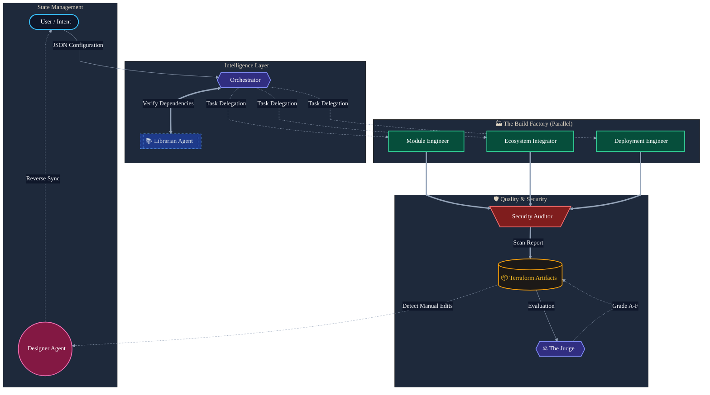

# CloudAccel: The Autonomous DevOps Implementation System

**CloudAccel** is an **Autonomous Enterprise Agent** that converts high-level architecture specifications into secure, standardized, and deployable Terraform ecosystems.

It bridges the "Last Mile" gap in DevOps by orchestrating a "Virtual Engineering Pod"—a team of specialized AI agents working in parallel to write, wire, secure, and document infrastructure.

---

## 1. The Problem: The "Last Mile" Gap in Enterprise DevOps

In the world of cloud infrastructure, there is a massive disconnect between **Architecture** and **Implementation**.

Solutions Architects design robust, compliant systems on whiteboards—for example, *"A PCI-DSS compliant payment gateway in US-East-1 with private networking."* However, translating that high-level intent into production-ready Infrastructure-as-Code (IaC) creates a significant bottleneck.

DevOps engineers are often left with "Blank Screen Paralysis," forced to manually write thousands of lines of Terraform boilerplate to connect simple resources. This manual translation introduces three critical risks:

*   **Inconsistency:** "Snowflake" infrastructure that varies from engineer to engineer.
*   **Security Drift:** Copy-pasting outdated snippets that leave ports open or using unencrypted storage.
*   **Dependency Hell:** Wiring together multiple modules (VPC, EC2, RDS) requires meticulous state management, leading to frequent deployment failures.

**The Brownfield Challenge**
The problem is even worse for existing environments. Thousands of companies are stuck with "ClickOps" infrastructure—resources created manually in the AWS Console. Reverse-engineering this legacy state into Terraform is often deemed too expensive or risky, leaving critical systems unmanaged.

While generic AI coding assistants can write snippets, they lack the context to build **cohesive, multi-file enterprise ecosystems** that work out of the box.

---

## 2. The Solution: CloudAccel

CloudAccel is an **Autonomous Implementation System**. It does not replace the Solutions Architect; it acts as a force multiplier for the DevOps team.

CloudAccel transforms the IaC workflow from a manual coding task into a **visual, intent-based design experience**. It takes a defined project configuration (via JSON or a Visual Editor) and orchestrates a "Virtual Engineering Pod"—a team of specialized AI agents working in parallel—to write, wire, secure, and document the entire infrastructure bundle.

It shifts the paradigm from "Writing Code" to "Reviewing Code," reducing the time-to-deployment from days to minutes.

### Key Capabilities
*   **Intent-Based Design:** Users define high-level requirements (e.g., "VPC with 2 public subnets") via a visual editor, and the agents handle the implementation details.
*   **Autonomous Security:** The system doesn't just flag vulnerabilities; it **auto-remediates** them. If a user requests an insecure security group, the agent overrides it to a secure default before code is generated.
*   **Brownfield Modernization:** For existing resources, CloudAccel acts as a translation layer. It generates not just the Terraform code to match the legacy state, but also the specific `import_resources.sh` scripts required to bind that state, solving the migration problem instantly.

---

## 3. Architecture: The Virtual Engineering Pod

To achieve enterprise-grade reliability, CloudAccel moves beyond simple prompt-response loops. It utilizes a sophisticated **Hub-and-Spoke Multi-Agent System** powered by **Google Gemini 2.5 Flash**.

### The Agent Roster

| Agent Name | Role | Responsibilities |
| :--- | :--- | :--- |
| **The Planner** | Orchestrator Agent | Acting as the Project Manager, it analyzes configuration state, creates strict execution plans, manages request lifecycles, delegates tasks, and maintains global state to ensure no agent works in isolation. |
| **The Librarian** | Researcher (Tool Use) | The Enterprise Standard Enforcer. Uses **Google Search** to query the live Terraform Registry for the exact, latest verified version of every required community module, ensuring code is deployable today. |
| **Module Engineer** | Builder (Parallel) | Generates standardized, reusable resource blocks. |
| **Ecosystem Integrator** | Wiring Expert (Parallel) | Handles complex "wiring" using `for_each` loops to connect resources dynamically (DRY principles). |
| **Deployment Engineer** | Scaler (Parallel) | Sets up regional folder structures, provider aliases, and state backend configurations. |
| **The Gatekeeper** | Security Auditor Agent | The Compliance Officer. Scans generated HCL against CIS and NIST benchmarks. **Auto-remediates** vulnerabilities (like open security groups) before code delivery to prevent insecure configurations. |
| **The Judge** | Quality Evaluator Agent | Grades the final output against a strict rubric (Syntax, Security, Standards). Provides a **Quality Score (0-100)** and a detailed report (`QUALITY_REPORT.md`) explaining exactly where code can be improved. |
| **The Sync Engine** | Designer Agent | The Source of Truth. Parses manual code edits in the IDE and reverse-engineers them back into the high-level architecture state, ensuring the visual diagram never drifts from reality. |

---

## 4. The Project Journey & Key Implementations

Our journey began with a simple question: *"Can an AI agent replace the first week of a DevOps project?"*

We initially built a linear code generator, but quickly hit the limits of generic LLM responses—code was often syntactically correct but structurally flawed (e.g., missing dependencies or variables). We realized that building enterprise infrastructure requires **Separation of Concerns**. We pivoted to a **Multi-Agent Architecture**, isolating the Logic (Architect) from the Implementation (Engineers) and the Validation (Auditor).

We successfully implemented **8 key agentic concepts** required for this challenge:

### 1. Multi-agent System
*   **Hybrid Architecture:** We utilize both **Sequential** and **Parallel** patterns.
    *   *Sequential:* The macro-workflow follows a strict dependency chain: `Orchestrator` (Plan) → `Librarian` (Research) → `Build Team` (Implement) → `Auditor` (Secure) -> `Judge`
    *   *Parallel:* Inside the "Build Team," agents are architected to execute concurrently. Additionally, the **Writer Agent** (Documentation) and **Judge Agent** (Evaluation) run in parallel at the end of the pipeline to minimize total latency.
*   **LLM:** All agents are powered by **Gemini 2.5 Flash**.

### 2. Tools
*   **Google Search:** The **Librarian Agent** uses Search Grounding to verify live Terraform module versions.
*   **Custom Tools:** The Orchestrator uses a regex-based **Bundler/Splitter** to manage multi-file generation within rate limits.

### 3. Sessions & Memory
*   **State Management:** The app maintains a **Time Travel** history stack, allowing users to rollback project snapshots.

### 4. Context Engineering
*   **Context Compaction:** We split prompts into specialized personas (`MODULE_ENGINEER`, `AUDITOR`) and feed agents only the specific configuration slice they need (e.g., VPC config) rather than the entire project state.

### 5. Observability
*   **Logging:** A real-time **Agent Console** visualizes execution with unique Trace IDs (`runId`) and granular debug streams.

### 6. A2A Protocol (Agent-to-Agent)
*   **Hub-and-Spoke Protocol:** CloudAccel uses a centralized Orchestrator pattern. Rather than agents chatting unstructured text to each other, they communicate via strict **Schema-Based Contracts**.
    *   *Example:* The **Librarian Agent** outputs a structured `ModuleManifest`. The Orchestrator captures this and injects it into the context of the **Module Engineer**, ensuring dependencies are resolved before code generation begins.
    *   *Example:* The **Build Team** outputs raw HCL code, which is aggregated and piped directly into the **Security Auditor** for validation.

### 7. Agent Evaluation
*   **Model-Based Eval:** The **Judge Agent** grades the final output against a strict rubric (Syntax, Security, Standards), producing a 0-100 score and `QUALITY_REPORT.md`.

### 8. Agent Deployment
*   **Serverless Vercel Deployment:** The system is deployed as a Serverless Single Page Application (SPA) on **Vercel**. By leveraging the Google GenAI SDK directly in the browser, we removed the need for heavy backend orchestration, demonstrating a scalable, zero-infrastructure agent model.

**Why Google Gemini?**
CloudAccel relies on **Gemini 2.5 Flash** for two critical reasons:
1.  **Long Context Window:** An enterprise infrastructure bundle might contain 20+ files. The Auditor Agent needs to analyze the *entire* repository simultaneously to identify cross-file security risks.
2.  **Speed:** The parallel agent architecture requires multiple LLM round-trips. Flash's low latency ensures the UI remains responsive, feeling like a productivity tool rather than a batch job.

---

## 5. Tools & Technologies

| Category | Technology | Usage in CloudAccel |
| :--- | :--- | :--- |
| **AI Model** | **Google Gemini 2.5 Flash** | The core brain powering all agents (chosen for speed & massive context window). |
| **IDE** | **Google AI Studio** | A web-based tool to prototype and build applications using Google's Gemini models |
| **Tools** | **Google Search** | Used by the Librarian Agent for grounding Terraform module versions. |
| **Frontend** | React 19, TypeScript | The framework for the interactive Agent Console and UI. |
| **Visualization** | D3.js | Interactive Force-Directed Topology Graph for infrastructure visualization. |
| **State Management** | LocalStorage / In-Memory | Manages the "Time Travel" history stack and session state. |
| **Hosting** | Vercel | Serverless deployment platform for the SPA. |

---

## 6. Conclusion & Roadmap

CloudAccel demonstrates the future of AI-assisted DevOps. It enforces standardization through agentic workflows, ensures security through automated auditing, and accelerates delivery by removing the drudgery of boilerplate coding. By treating infrastructure as a collaborative process between specialized AI agents and human architects, CloudAccel allows engineers to focus on *Architecture*, while the Agents handle the *Implementation*.

**What's Next:**
*   **Improving quality:** Quality of the system has to be improved further to make it more reliable
*   **AWS Discovery Agent:** Building an agent that connects directly to a user's AWS account to "clone" a live environment into the CloudAccel designer for instant refactoring.
*   **CI/CD Generation:** Expanding the system to write GitHub Actions pipelines.
*   **FinOps Agent:** Integrating cost estimation to provide dollar-value impact analysis before deployment.
*   **Log Retention and Alerting:** Storing the logs generated by each user as well as setting up monitoring and alerting mechanisms for enhanced security

## 📄 License

MIT License. Created for the Google - Kaggle Agentic AI Hackathon.
