# CloudAccel: The Autonomous DevOps Implementation Engine

**CloudAccel** is an **Autonomous Enterprise Agent** that converts high-level architecture specifications into secure, standardized, and deployable Terraform ecosystems.

It bridges the "Last Mile" gap in DevOps by orchestrating a "Virtual Engineering Pod"—a team of specialized AI agents working in parallel to write, wire, secure, and document infrastructure.

---

## 1. The Problem: The "Last Mile" Gap in Enterprise DevOps

In the world of cloud infrastructure, there is a massive disconnect between **Architecture** and **Implementation**.

Solutions Architects design robust, compliant systems on whiteboards—for example, *"A PCI-DSS compliant payment gateway in US-East-1 with private networking."* However, translating that high-level intent into production-ready Infrastructure-as-Code (IaC) creates a significant bottleneck.

DevOps engineers are often left with "Blank Screen Paralysis," forced to manually write thousands of lines of Terraform boilerplate to connect simple resources. This manual translation introduces three critical risks:

*   **Inconsistency:** "Snowflake" infrastructure that varies from engineer to engineer.
*   **Security Drift:** Copy-pasting outdated snippets that leave ports open or using unencrypted storage.
*   **Dependency Hell:** Wiring together multiple modules (VPC, EC2, RDS) requires meticulous state management, leading to frequent deployment failures.

**The Brownfield Challenge**
The problem is even worse for existing environments. Thousands of companies are stuck with "ClickOps" infrastructure—resources created manually in the AWS Console. Reverse-engineering this legacy state into Terraform is often deemed too expensive or risky, leaving critical systems unmanaged.

While generic AI coding assistants can write snippets, they lack the context to build **cohesive, multi-file enterprise ecosystems** that work out of the box.

---

## 2. The Solution: CloudAccel

CloudAccel is an **Autonomous Implementation System**. It does not replace the Solutions Architect; it acts as a force multiplier for the DevOps team.

CloudAccel transforms the IaC workflow from a manual coding task into a **visual, intent-based design experience**. It takes a defined project configuration (via JSON or a Visual Editor) and orchestrates a "Virtual Engineering Pod"—a team of specialized AI agents working in parallel—to write, wire, secure, and document the entire infrastructure bundle.

It shifts the paradigm from "Writing Code" to "Reviewing Code," reducing the time-to-deployment from days to minutes.

### Key Capabilities
*   **Intent-Based Design:** Users define high-level requirements (e.g., "VPC with 2 public subnets") via a visual editor, and the agents handle the implementation details.
*   **Autonomous Security:** The system doesn't just flag vulnerabilities; it **auto-remediates** them. If a user requests an insecure security group, the agent overrides it to a secure default before code is generated.
*   **Brownfield Modernization:** For existing resources, CloudAccel acts as a translation layer. It generates not just the Terraform code to match the legacy state, but also the specific `import_resources.sh` scripts required to bind that state, solving the migration problem instantly.

---

## 3. Architecture: The Virtual Engineering Pod

To achieve enterprise-grade reliability, CloudAccel moves beyond simple prompt-response loops. It utilizes a sophisticated **Hub-and-Spoke Multi-Agent System** powered by **Google Gemini 2.5 Flash**.

```mermaid
%%{
  init: {
    'theme': 'base',
    'themeVariables': {
      'primaryColor': '#1e293b',
      'primaryTextColor': '#f8fafc',
      'primaryBorderColor': '#475569',
      'lineColor': '#94a3b8',
      'secondaryColor': '#0f172a',
      'tertiaryColor': '#1e293b',
      'fontFamily': 'Inter, system-ui, sans-serif'
    },
    'flowchart': {
      'curve': 'monotoneX',
      'nodeSpacing': 60,
      'rankSpacing': 60
    }
  }
}%%
flowchart TD
    %% Classes for styling
    classDef user fill:#0f172a,stroke:#38bdf8,stroke-width:2px,color:#fff,shadow:5px
    classDef brain fill:#312e81,stroke:#818cf8,stroke-width:2px,color:#fff
    classDef tool fill:#1e3a8a,stroke:#60a5fa,stroke-width:1px,stroke-dasharray: 5 5,color:#cbd5e1
    classDef builder fill:#064e3b,stroke:#34d399,stroke-width:2px,color:#fff
    classDef guard fill:#7f1d1d,stroke:#f87171,stroke-width:2px,color:#fff
    classDef artifact fill:#1c1917,stroke:#f59e0b,stroke-width:2px,color:#fbbf24
    classDef sync fill:#831843,stroke:#f472b6,stroke-width:2px,color:#fff

    User([👤 User / Intent]) -->|JSON Configuration| Orch{{🧠 Orchestrator}}
    
    subgraph Intelligence ["🧠 Intelligence Layer"]
        direction LR
        Orch <==>|Verify Dependencies| Lib[[📚 Librarian Agent]]
    end

    subgraph Factory ["🏭 The Build Factory (Parallel)"]
        direction TB
        Orch -.->|Task Delegation| Mod[🧱 Module Engineer]
        Orch -.->|Task Delegation| Eco[🔌 Ecosystem Integrator]
        Orch -.->|Task Delegation| Dep[🚀 Deployment Engineer]
    end

    subgraph Validation ["🛡️ Quality & Security"]
        Mod & Eco & Dep ==> Aud[\👮 Security Auditor/]
        Aud ==>|Scan Report | Output[(📦 Terraform Artifacts)]
        Output -->|Evaluation| Judge{{⚖️ The Judge}}
        Judge -.->|Grade A-F| Output
    end

    subgraph State ["🔄 State Management"]
        Output -.->|Detect Manual Edits| Designer((🎨 Designer Agent))
        Designer -.->|Reverse Sync| User
    end

    %% Assign Classes
    class User user
    class Orch,Judge brain
    class Lib tool
    class Mod,Eco,Dep builder
    class Aud guard
    class Output artifact
    class Designer sync
```

### The Agent Roster

**1. The Planner (Orchestrator Agent)**
Acting as the Project Manager, the Orchestrator analyzes the configuration state to create a strict execution plan. It creates the file structure, manages the lifecycle of the request, and delegates tasks to sub-agents. It maintains the global state, ensuring no agent works in isolation.

**2. The Librarian (Tool Use: Google Search Grounding)**
*The Enterprise Standard Enforcer.* One of the biggest issues with AI-generated Terraform is outdated syntax. The Librarian Agent uses **Google Search** to query the live Terraform Registry. It identifies the *exact, latest verified version* of every required community module before any code is written. This ensures the generated code is deployable today, not yesterday.

**3. The Build Team (Parallel Agents)**
To maximize speed, the Orchestrator triggers specialized agents that run in parallel:
*   **The Module Engineer:** Generates standardized, reusable resource blocks.
*   **The Ecosystem Integrator:** Handles complex "wiring" using `for_each` loops to connect resources dynamically (DRY principles).
*   **The Deployment Engineer:** Sets up regional folder structures, provider aliases, and state backend configurations.

**4. The Gatekeeper (Security Auditor Agent)**
*The Compliance Officer.* Before code is presented to the user, the Auditor Agent scans the generated HCL against CIS and NIST benchmarks. If it detects vulnerabilities like open security groups, it **auto-remediates** the code, preventing insecure configurations from slipping through.

**5. The Judge (Quality Evaluation Agent)**
A distinct evaluation agent that grades the final output against a strict rubric (Syntax, Security, Standards). It provides a "Quality Score" (0-100) and a detailed report (`QUALITY_REPORT.md`) explaining exactly where the code can be improved.

**6. The Sync Engine (Designer Agent)**
*The Source of Truth.* If an engineer manually tweaks the generated code in the IDE, the Designer Agent reverse-engineers those changes back into the high-level architecture state, ensuring the visual diagram never drifts from reality.

---

## 4. The Project Journey & Key Implementations

Our journey began with a simple question: *"Can an AI agent replace the first week of a DevOps project?"*

We initially built a linear code generator, but quickly hit the limits of generic LLM responses—code was often syntactically correct but structurally flawed (e.g., missing dependencies or variables). We realized that building enterprise infrastructure requires **Separation of Concerns**. We pivoted to a **Multi-Agent Architecture**, isolating the Logic (Architect) from the Implementation (Engineers) and the Validation (Auditor).

We successfully implemented **6 key agentic concepts** required for this challenge:

1.  **Multi-Agent System:** Utilizing both Sequential chains (`Orchestrator` → `Librarian` → `Builder`) and Parallel execution (The Build Team) to balance logic and speed.
2.  **Tools:** Integrating **Google Search** for the Librarian Agent to solve the "Hallucinated Version" problem.
3.  **Agent Evaluation:** Implementing a **Model-Based Evaluation Loop**. The Judge Agent serves as an automated QA, ensuring that the system can critique its own work and provide a feedback loop to the user via the Quality Badge.
4.  **Observability:** Building a real-time **Agent Console** that visualizes the "thoughts" and actions of the swarm with unique trace IDs.
5.  **State Management:** Implementing a **Time Travel** history system, allowing users to rollback complex configuration changes instantly.
6.  **Deployment:** Delivering the entire system as a serverless SPA on Vercel, demonstrating that powerful agentic workflows can live entirely on the client-side.

**Why Google Gemini?**
CloudAccel relies on **Gemini 2.5 Flash** for two critical reasons:
1.  **Long Context Window:** An enterprise infrastructure bundle might contain 20+ files. The Auditor Agent needs to analyze the *entire* repository simultaneously to identify cross-file security risks.
2.  **Speed:** The parallel agent architecture requires multiple LLM round-trips. Flash's low latency ensures the UI remains responsive, feeling like a productivity tool rather than a batch job.

---

## 5. Conclusion & Roadmap

CloudAccel demonstrates the future of AI-assisted DevOps. It enforces standardization through agentic workflows, ensures security through automated auditing, and accelerates delivery by removing the drudgery of boilerplate coding. By treating infrastructure as a collaborative process between specialized AI agents and human architects, CloudAccel allows engineers to focus on *Architecture*, while the Agents handle the *Implementation*.

**What's Next:**
*   **AWS Discovery Agent:** Building an agent that connects directly to a user's AWS account to "clone" a live environment into the CloudAccel designer for instant refactoring.
*   **FinOps Agent:** Integrating cost estimation to provide dollar-value impact analysis before deployment.
*   **CI/CD Generation:** Expanding the Deployment Engineer to write GitHub Actions pipelines.

## 📄 License

MIT License. Created for the Google - Kaggle Agentic AI Hackathon.
